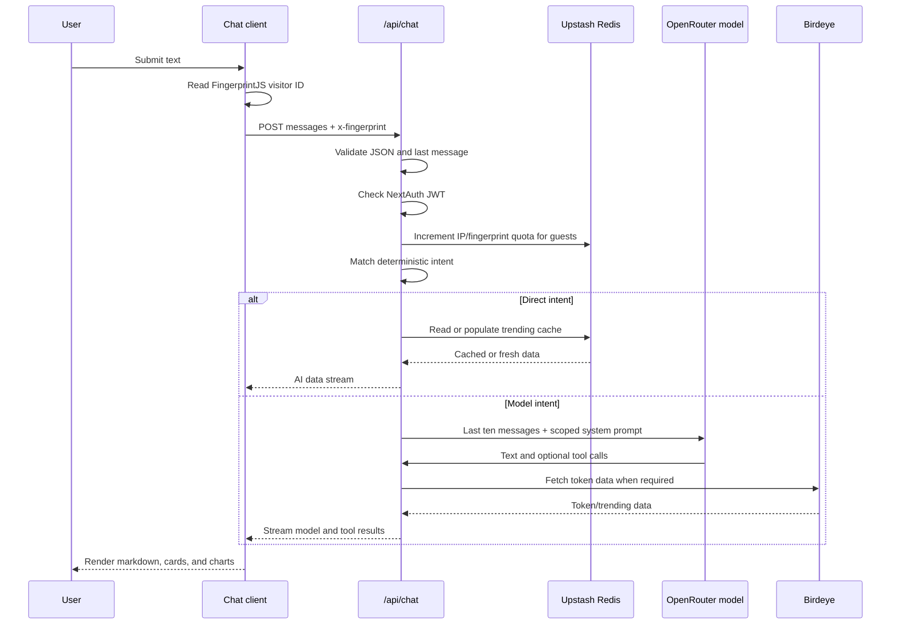

# TokenMind

TokenMind is a Next.js AI chat application for exploring Solana tokens and asking questions about the Solana ecosystem. It combines streamed model responses with tool calls for Birdeye market data, deterministic responses for common requests, Google authentication, Redis-backed caching, and a daily guest quota.

The application currently focuses on token discovery, token overviews, and Solana knowledge. Token swaps, Twitter trend data, token creation, news, chat persistence, and embedded wallets are not implemented in the current repository.

## Contents

- [Capabilities](#capabilities)
- [Architecture](#architecture)
- [Request lifecycle](#request-lifecycle)
- [Repository structure](#repository-structure)
- [Technology stack](#technology-stack)
- [Prerequisites](#prerequisites)
- [Local setup](#local-setup)
- [Environment variables](#environment-variables)
- [Development commands](#development-commands)
- [API routes](#api-routes)
- [AI agents and tools](#ai-agents-and-tools)
- [Caching and guest limits](#caching-and-guest-limits)
- [Authentication and wallets](#authentication-and-wallets)
- [Deployment](#deployment)
- [Known limitations](#known-limitations)
- [Troubleshooting](#troubleshooting)

## Capabilities

### Implemented

- Chat interface at `/chat`, with `/` redirecting to it.
- Streaming text and tool responses through the Vercel AI SDK.
- Trending Solana tokens from Birdeye, limited to the top ten returned items.
- Solana token overview data from Birdeye when a token address is supplied.
- Solana protocol, tooling, documentation, and concept explanations generated with structured output and embedded links.
- Deterministic responses for greetings, thanks, help, and straightforward trending-token requests.
- Google OAuth through NextAuth with JWT sessions.
- Five-request daily limit for unauthenticated visitors, tracked by IP and optional FingerprintJS visitor ID.
- Five-minute Redis caching for trending-token and token-overview requests.
- Solana connection context configured for Devnet during development and Mainnet otherwise.

### Placeholder or unavailable

- The swap and Twitter-trending tools only return a “feature coming” response.
- No token creation, news integration, blockchain transaction, or chat-history persistence exists.
- The wallet provider has an empty adapter list, so no browser wallet is enabled by default.
- The sidebar still presents a guest-oriented UI and does not complete sign-in actions.

## Architecture

```mermaid
flowchart TD
		Browser[Browser] --> Root[Next.js root layout]
		Root --> Providers[Theme, Solana, NextAuth providers]
		Providers --> ChatPage[/chat page]
		ChatPage --> Shell[ChatShell and chat components]
		Shell --> ChatProvider[AiChatProvider]
		ChatProvider --> ChatAPI[POST /api/chat]
		ChatAPI --> Auth{NextAuth JWT?}
		Auth -->|No| Quota[Upstash guest quota]
		Auth -->|Yes| Intent[Intent matching]
		Quota --> Intent
		Intent -->|Greeting/help/trending| Direct[Direct data stream]
		Intent -->|Other request| Model[OpenRouter model]
		Model --> Tools[Registered AI tools]
		Tools --> Birdeye[Birdeye token APIs]
		Tools --> Knowledge[Structured Solana knowledge generation]
		Birdeye --> Redis[Upstash Redis cache]
		Direct --> Shell
		Tools --> Shell
		Model --> Shell
```

The root page performs a server redirect to `/chat`. The chat page mounts `AppProvider`, which supplies the sidebar, AI chat context, suspense boundary, and toast notifications. The root layout supplies theme, authentication, Solana connection, and wallet modal contexts.

## Request lifecycle



Only the last ten messages are sent to the model. The optional `walletAddress` query parameter is accepted and validated by the route, although the current client sends `walletAddress=null` and does not connect a wallet address to chat requests.

## Repository structure

```text
ai/
	agents.ts                         AI SDK tool definitions
	agent/                            Tool-specific data fetching and intent logic
		agent.ts                        Agent registry and system prompts
		get-token-info/                 Birdeye token overview integration
		trending-token/                 Birdeye trending-token integration
		static-response/                Deterministic intents and cached direct result
	knowledge/agent.ts                Structured Solana knowledge generation
src/
	app/                              Next.js routes and pages
		api/auth/[...nextauth]/         Google OAuth callback routes
		api/chat/                       Streaming chat endpoint
		api/usage/                      Guest quota endpoint
		chat/                           Chat page and layout
	components/                       Chat, sidebar, token, and UI components
	context/                          Theme, auth, wallet, and chat providers
	constants/                        API-key aliases and cache/quota constants
	hooks/                            Usage, fingerprint, and UI hooks
	lib/                              Model, auth, cache, rate-limit, and response helpers
	generated/prisma/                 Generated Prisma client artifacts
public/                             Static assets
```

## Technology stack

- **Next.js 16** with the App Router and Webpack development/build commands
- **React 19** and TypeScript
- **Vercel AI SDK** (`ai`, `@ai-sdk/react`, and `@ai-sdk/openai`) for streaming and tool calling
- **OpenRouter** using the `nvidia/nemotron-3.5-lightning:free` model
- **Birdeye** for Solana token market data
- **Upstash Redis** for cache entries and guest usage counters
- **NextAuth** with Google OAuth and JWT sessions
- **Solana Wallet Adapter** and `@solana/web3.js` for connection context
- **Tailwind CSS**, Radix UI primitives, Recharts, React Markdown, and Lucide icons
- **FingerprintJS** for a browser visitor identifier used with guest quotas

## Prerequisites

- Node.js compatible with the installed Next.js version
- npm
- A Birdeye API key
- An OpenRouter API key
- Upstash Redis REST credentials for caching and guest limits
- Google OAuth credentials if authentication is needed

## Local setup

1. Install dependencies:

	 ```bash
	 npm install
	 ```

2. Create `.env.local` in the repository root. Copy the variable names from `.env.example` and add the values described below. `OPEN_ROUTER_API_KEY` must be added manually because the current example file does not list it.

3. Start the development server:

	 ```bash
	 npm run dev
	 ```

4. Open [http://localhost:3000](http://localhost:3000). The root route redirects to `/chat`.

## Environment variables

| Variable | Required for | Current use |
| --- | --- | --- |
| `OPEN_ROUTER_API_KEY` | Model-backed chat and knowledge | OpenRouter provider in `src/lib/model.ts`; add this to `.env.local` |
| `BIRD_EYE_API_KEY` | Token data | Birdeye trending and token-overview requests |
| `UPSTASH_REDIS_REST_URL` | Cache and quotas | Read by `Redis.fromEnv()` |
| `UPSTASH_REDIS_REST_TOKEN` | Cache and quotas | Read by `Redis.fromEnv()` |
| `AUTH_GOOGLE_ID` | Google sign-in | NextAuth Google provider |
| `AUTH_GOOGLE_SECRET` | Google sign-in | NextAuth Google provider |
| `NEXTAUTH_SECRET` | Session verification | NextAuth and server-side JWT checks |
| `NEXTAUTH_URL` | Local/hosted auth callbacks | Set to `http://localhost:3000` locally |
| `GEMINI_KEY` | None currently | Declared but unused by the active model |
| `MORALIS_API_KEY` | None currently | Declared but unused |
| `DATABASE_URL` | None currently | Present for generated Prisma artifacts; no runtime database access exists |

Never commit `.env.local` or expose server-only API keys in client components. For Google OAuth, configure the provider callback URL for the deployed origin and the local origin as appropriate.

## Development commands

| Command | Purpose |
| --- | --- |
| `npm run dev` | Start Next.js development mode with Webpack |
| `npm run build` | Create a production build |
| `npm run start` | Serve a completed production build |
| `npm run lint` | Run the configured Next.js lint command |

There is currently no test script, CI workflow, migration command, or database seed command in the repository.

## API routes

### `POST /api/chat`

Accepts a JSON body containing a non-empty `messages` array. The final message must contain non-empty string content. Optional query parameters and headers:

- `walletAddress`: validated as a Solana-style base58 address and included in the model system context when valid.
- `x-fingerprint`: FingerprintJS visitor ID used for guest quota accounting.

Unauthenticated requests consume one daily quota unit. The route returns a streamed AI SDK response for model requests and also uses the same stream format for deterministic text or tool results. The route runs on the Edge runtime.

### `GET /api/usage`

Returns the current guest quota based on IP and optional `x-fingerprint`:

```json
{ "unlimited": false, "remaining": 4 }
```

Authenticated requests return `unlimited: true` and the configured guest limit as `remaining`.

### `/api/auth/[...nextauth]`

Handles the NextAuth GET and POST endpoints for Google OAuth. Sessions use the JWT strategy.

## AI agents and tools

The registry in `ai/agent/agent.ts` merges tools into one map. The model uses native automatic tool selection; there is no separate router model call.

| Agent/tool | Behavior | Data source |
| --- | --- | --- |
| `GET_TRENDING_TOKEN` | Returns up to ten trending Solana tokens and prices | Birdeye, cached for 300 seconds |
| `GET_TOKEN_INFO` | Returns a token overview for a supplied address | Birdeye, cached for 300 seconds |
| `KNOWLEDGE` | Generates structured information and relevant links | OpenRouter model |
| `GET_TWITTER_TRENDING_TOPICS` | Placeholder response | None |
| `SWAP_TOKEN` | Logs parameters and returns a placeholder response | None |

Simple greetings, thanks, help requests, and most direct trending-token questions are intercepted by `matchDeterministicIntent`. This avoids a model call for those cases. A trending request asking for an explanation is allowed through to the model instead.

## Caching and guest limits

Birdeye results use `getCachedDataOrFetch` in `src/lib/cache.ts`:

- Trending data key: `trending-tokens`
- Token info key: `token-info:<address>`
- Both TTLs: 300 seconds

Guest usage is tracked in Upstash Redis by UTC date. The API increments both an IP counter and, when supplied, a FingerprintJS counter. A request is allowed only when both observed counters are at or below the limit. The current limit is five requests per day, defined by `GUEST_DAILY_LIMIT`.

Authenticated users bypass the guest counter after the server verifies their NextAuth JWT.

## Authentication and wallets

Authentication is implemented with Google through NextAuth. It is not Civic Auth, and the repository does not contain Civic Auth packages or embedded-wallet creation/recovery code.

The root layout also mounts Solana `ConnectionProvider`, `WalletProvider`, and `WalletModalProvider`. Development uses Solana Devnet and other environments use Mainnet. Since `WalletProvider` receives `wallets={[]}`, no wallet adapter is currently enabled, and the chat client does not pass an active wallet address.

## Deployment

The project includes `vercel.json`, which configures installation with `npm install --legacy-peer-deps`. A typical Vercel deployment is:

1. Import the repository into Vercel.
2. Add the required environment variables from the table above, especially `OPEN_ROUTER_API_KEY`, Birdeye, Upstash, and NextAuth values.
3. Set the Google OAuth callback configuration and `NEXTAUTH_URL` to the deployment URL.
4. Deploy using the project defaults. The configured build command is `npm run build`.

The chat and usage API routes explicitly use the Edge runtime. Ensure the deployed environment has network access to OpenRouter, Birdeye, and Upstash REST APIs.

## Known limitations

- No automated tests are included.
- `npm run lint` may require adjustment because the package uses a Next.js lint script while the installed Next.js major version has changed its lint tooling behavior.
- Chat messages exist only in client memory and disappear on refresh or “new chat”.
- The “delete all” sidebar action currently displays a toast but does not delete persisted data because there is no chat database.
- Token address validation is format-based; it does not prove that an address is a token mint.
- Birdeye and model failures are converted into user-facing error objects or stream errors; API availability and quotas can affect responses.

## Troubleshooting

### Model requests fail

Confirm that `OPEN_ROUTER_API_KEY` exists in `.env.local`. `GEMINI_KEY` is not a substitute because the active model is configured through OpenRouter.

### Trending or token information is unavailable

Confirm `BIRD_EYE_API_KEY`, then inspect the Birdeye account quota and the server logs. Cached values may remain available for up to five minutes after a successful request.

### Guest usage is unavailable

Confirm both Upstash variables are present and point to the same Redis database. The chat and usage routes depend on Upstash for counters even when no cache value exists.

### Google sign-in fails

Confirm all Google and NextAuth variables are set, `NEXTAUTH_URL` matches the current origin, and the OAuth callback URL is registered with Google.

### Wallet connection is empty

This is expected with the current implementation: the wallet provider is mounted, but its adapter list is empty. Adding a wallet requires installing/configuring adapters and then wiring the connected public key into chat requests.